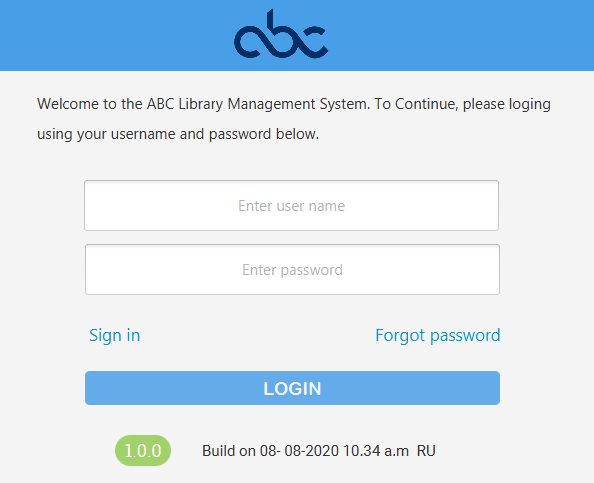
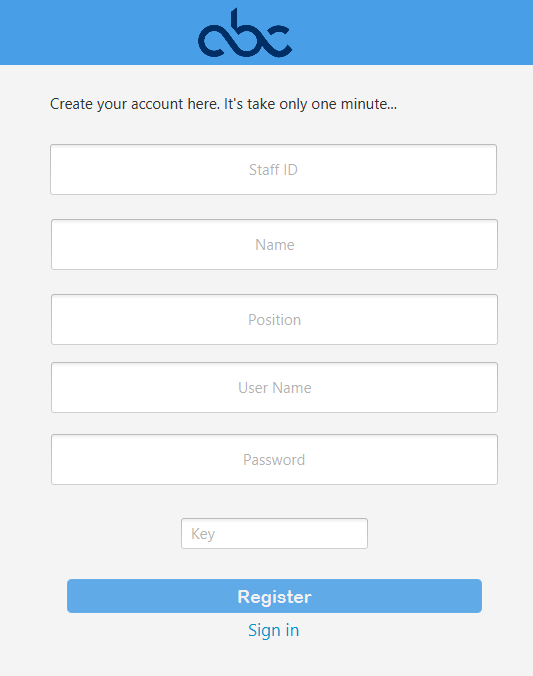
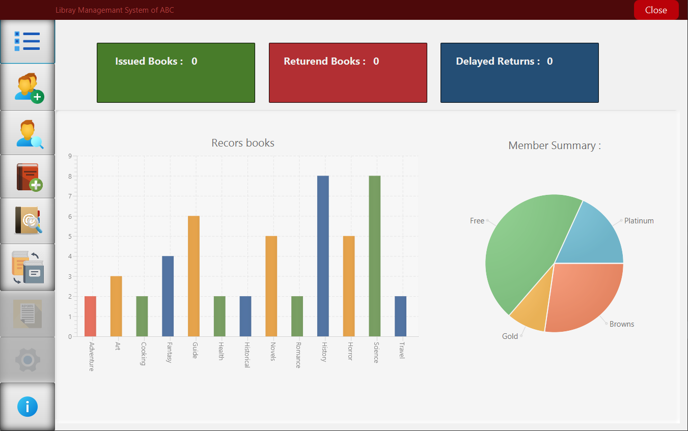
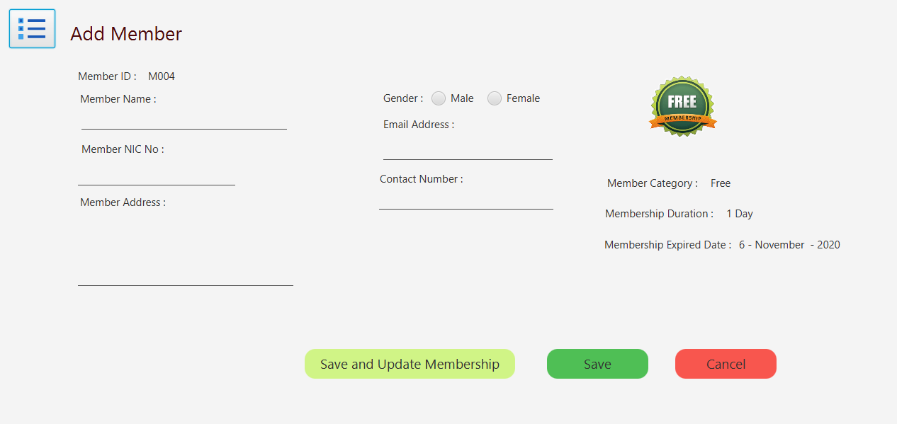
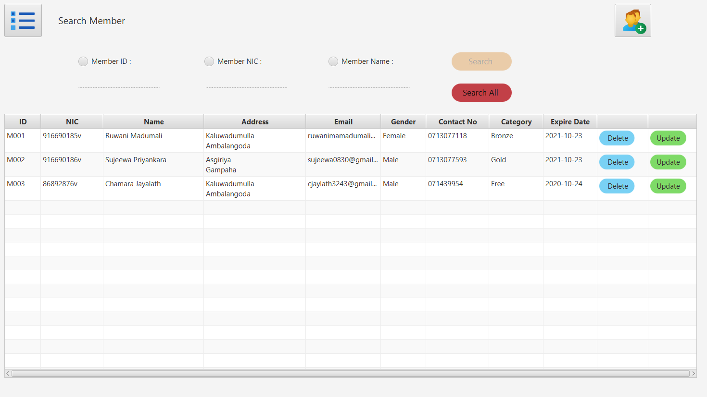
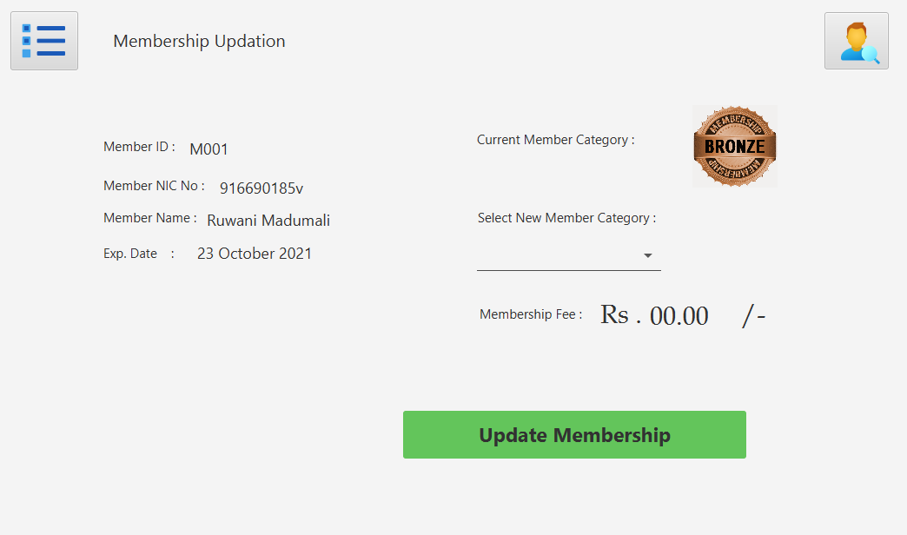
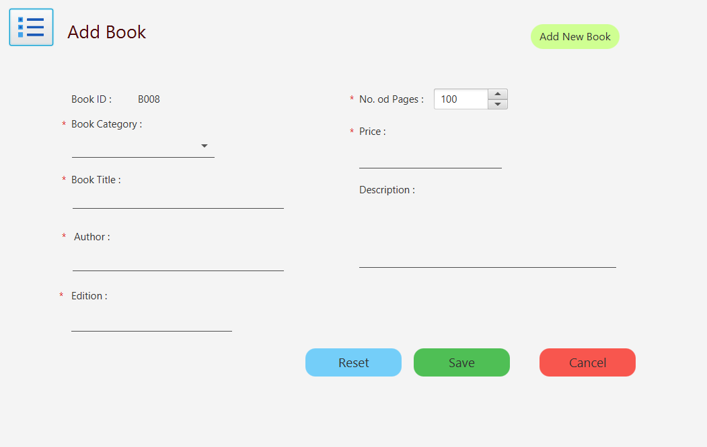
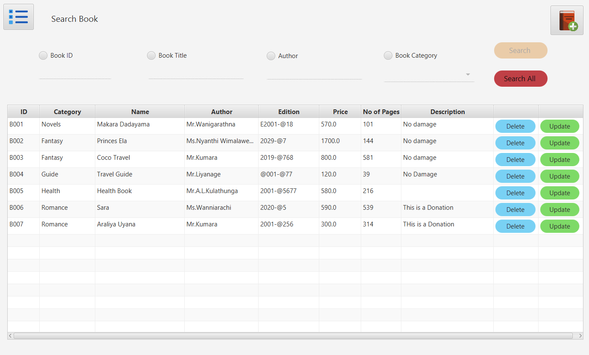
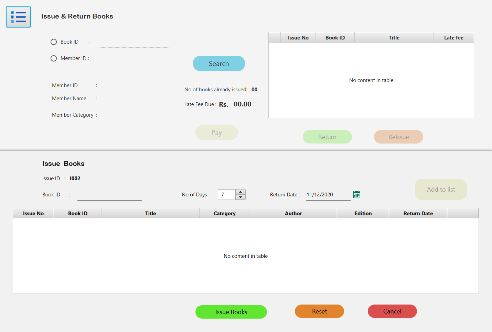

# Library Management System
> Project represents small Library management system using JDBC

## Introduction 
Management software for monitoring and controlling the transactions in a library .The project “Library Management System” is developed in Java, which mainly focuses on basic operations in a library like adding new books, and updating new information, searching books and members and return books.

This project of “LIBRARY MANAGEMENT” of gives us the complete information about the library. We can enter the record of new books and retrieve the details of books available in the library. We can issue the books to the members and maintain their records and can also check how many books are issued and stock available in the library. In this project we can maintain the late fine of members who returns the issued books after the due date.

Throughout the project the focus has been on presenting information and comments in an easy and intelligible manner. The project is very useful for those who want to know about Library Management System

## Requirements

Before use this application you must need to install JAVA runtime environment,JFoenix and MYSQL database management services..
links :
 - **[JAVA](https://www.oracle.com/technetwork/java/javase/downloads/jdk8-downloads-2133151.html)  runtime environment** 
 - **[MySQL](https://www.mysql.com/) Connector** - MySQL Connector/ODBC, once known as MyODBC, is computer software from Oracle Corporation. It is an ODBC interface and allows programming languages that support the ODBC interface to communicate with a MySQL database. 
 - **[JFoenix](https://mvnrepository.com/artifact/com.jfoenix/jfoenix/8.0.10)** - is an open source Java library, that implements Google Material Design using Java components
 
 ## Technologies
 > JAVA FX | 
 > JDBC

## Database
Find Database Configuration From src/Database, & set your Database Password

## Installation

If you did above installations, You only have to double click the jar file and install the jar file..

## Author

name  : Ruwani Madumali

e-mail : ruwanimadumalids@gmail.com

[Github] (https://github.com/RuwaniMadumali)
## User Login

## User Registration

## Dashboard

## Add Members

## Search Members

## Update Membership

## Add Books

## Search Books

## Issue & Return Books

## Contributing
Pull requests are welcome. For major changes, please open an issue first to discuss what you would like to change.

Please make sure to update tests as appropriate.

## License
This project is licensed under the MIT License - see the [LICENSE.txt](LICENSE.txt) file for details.